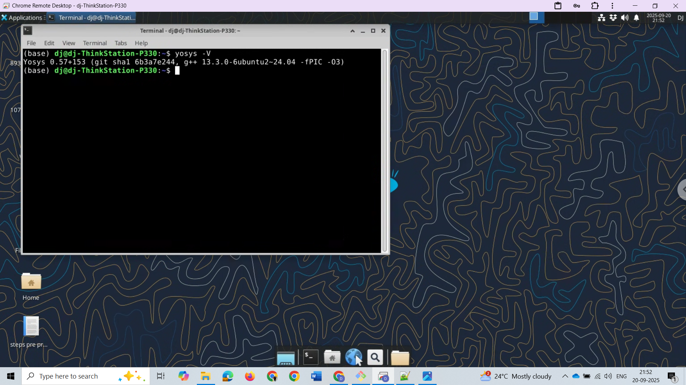
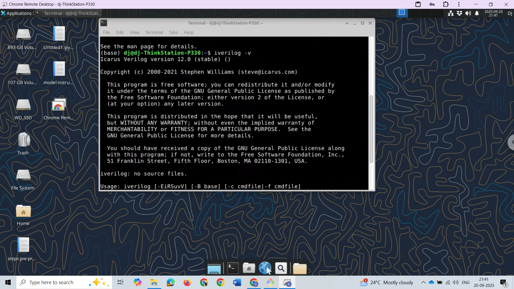
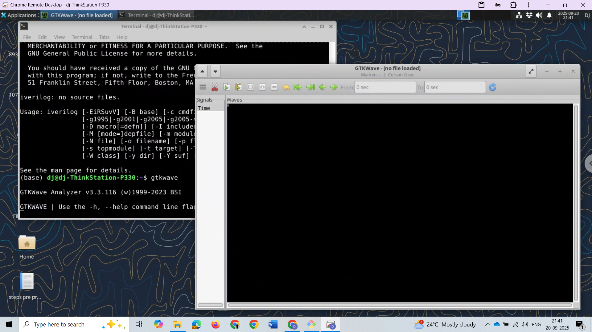

# Task-2: Install Tools for RISC-V SoC Flow

## 🎯 Objective
- Install the required tools for the RISC-V SoC Reference Tapeout Program.
- Verify installation with snapshots.

---

## 🖥️ Machine Configuration
- OS: Ubuntu 24.04
- CPU: Intel(R) Xeon(R) E-2224G CPU @ 3.50GHz
- RAM: 64 GB
- HDD: 1 TB

---

## 🔧 Tools Installed

### 1. Yosys
```bash
$ sudo apt-get update
$ git clone https://github.com/YosysHQ/yosys.git
$ cd yosys
$ sudo apt install make
$ sudo apt-get install build-essential clang bison flex \
  libreadline-dev gawk tcl-dev libffi-dev git \
  graphviz xdot pkg-config python3 libboost-system-dev \
  libboost-python-dev libboost-filesystem-dev zlib1g-dev
$ make config-gcc
$ make
$ sudo make install

✅ Verified with:
yosys -V
```
### 2.Icarus Verilog (iverilog)
```
sudo apt-get update
sudo apt-get install iverilog

✅ Verified with:
iverilog -V

```

### 3. GTKWave
```
sudo apt-get update
sudo apt-get install gtkwave

✅ Verified with:
gtkwave
```

### Status:
All Tools Installed Successfully. Snapshots are attached.

---

## 📷 Snapshots

### Yosys


### Iverilog


### GTKWave


---
